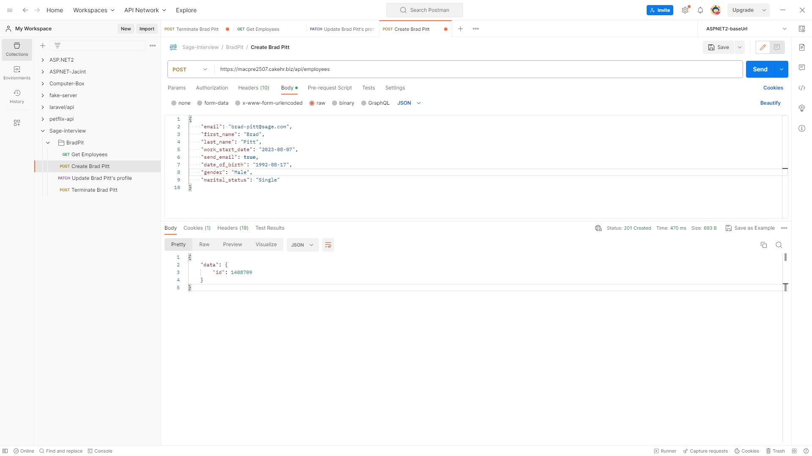
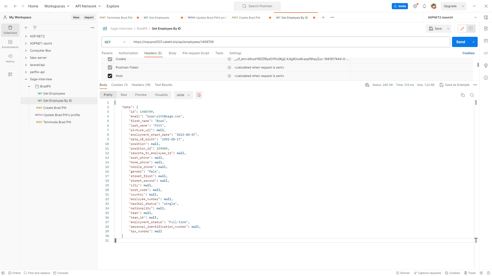
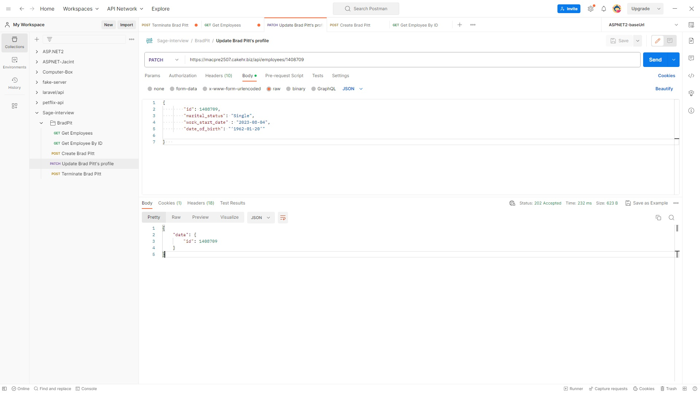
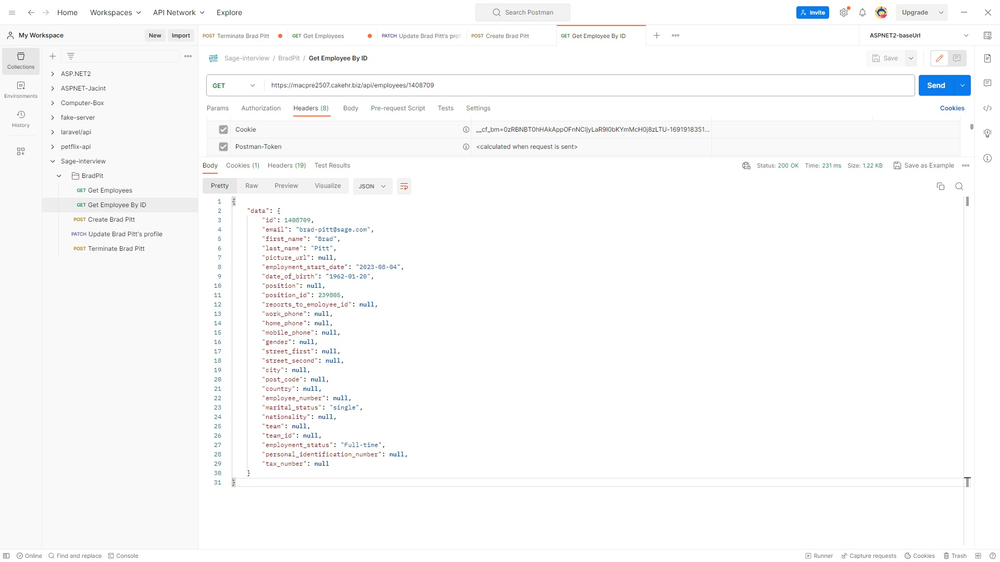
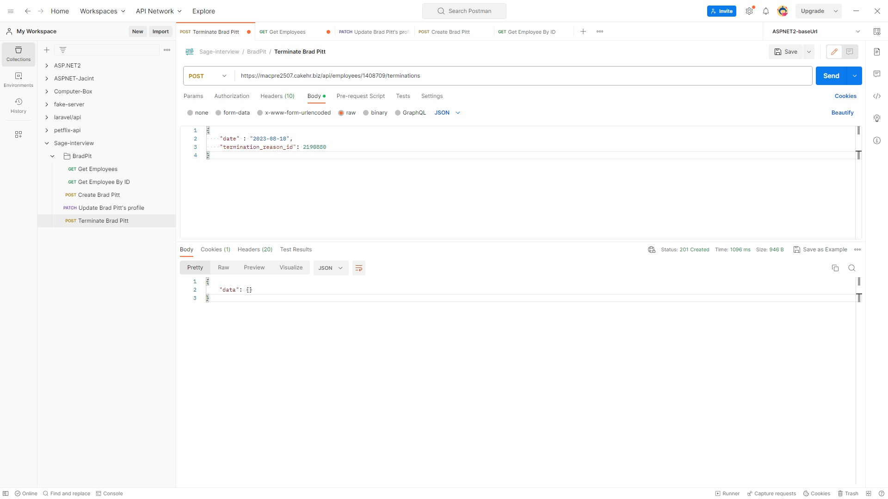
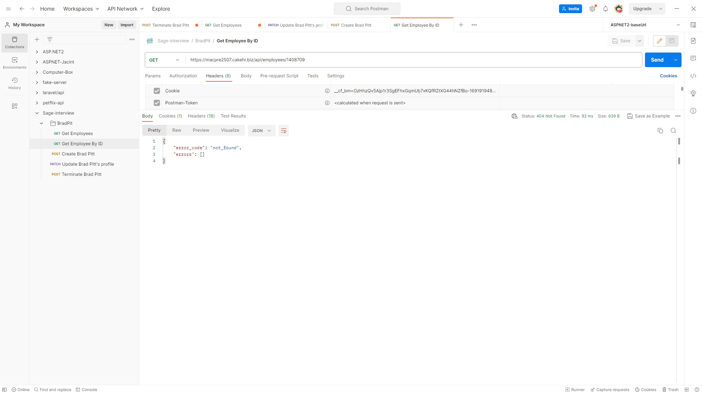

# POSTMAN EXERCISE  
  
## Thank you for taking the time to do an interview with us, in the following document you have three different questions we would like to evaluate. Please, send us back the script or solution once you have finished.  

  
### 1. From the company [https://macpre2507.cakehr.biz/](https://macpre2507.cakehr.biz/) we want to CREATE a new employee called Brad Pitt.  
  
First, in this endpoint `https://macpre2507.cakehr.biz/api/employees` with method `POST` this auth token inside the header
```
X-Auth-Token : ab2c02d851b4e8d9a22b47f97e561b99d605dbe85d5d27284d2a79451d39b0ffb10d99bf3c90c134
```
And this `body`
```json
{
    "email": "brad-pitt@sage.com",
    "first_name": "Brad",
    "last_name": "Pitt",
    "work_start_date": "2023-08-07",
    "send_email": true,
    "date_of_birth": "1992-08-17",
    "gender": "Male",
    "marital_status": "Single"
}
```
We get this `response`
```json
{
    "data": {
        "id": 1408709
    }
}
```
If we use the `id` as an input for the following endpoint `https://macpre2507.cakehr.biz/api/employees/1408709` with method `GET` we get the following `response`.
```json
{
    "data": {
        "id": 1408709,
        "email": "brad-pitt@sage.com",
        "first_name": "Brad",
        "last_name": "Pitt",
        "picture_url": null,
        "employment_start_date": "2023-08-07",
        "date_of_birth": "1992-08-17",
        "position": null,
        "position_id": 239805,
        "reports_to_employee_id": null,
        "work_phone": null,
        "home_phone": null,
        "mobile_phone": null,
        "gender": "Male",
        "street_first": null,
        "street_second": null,
        "city": null,
        "post_code": null,
        "country": null,
        "employee_number": null,
        "marital_status": "single",
        "nationality": null,
        "team": null,
        "team_id": null,
        "employment_status": "Full-time",
        "personal_identification_number": null,
        "tax_number": null
    }
```
Which confirms that the employee with name Brad Pitt, has ben successfully created.  
Here are the screenshots.  
  
  
___
  
  
  
  
  
  
  
  
  
  
  
### 2. Once we have the employee created, we need to UPDATE his date of birth to ‘1962-01-20’ and marital status to ‘Single’.  
  
Here's Brad info before the `UPDATE` (edited for convenience).
```json
{
    "data": {
        "id": 1408709,
        "email": "brad-pitt@sage.com",
        "first_name": "Brad",
        "last_name": "Pitt",
        (...)
        "employment_start_date": "2023-08-04",
        "date_of_birth": "1986-01-20",
        (...)
        "marital_status": "divorced",
        (...)
    }
}
```
Here's the data we pass to the `PATCH` endpoint to `UPDATE` Brad's data.
```json
{
        "id": 1408709,
        "marital_status": "Single",
        "work_start_date" : "2023-08-04",
        "date_of_birth": "‘1962-01-20’"

}   
```
**Note**: this endpoint has a `validation` built in, it will require `work_start_date` to be passed in with the rest of the data.  
And here's Brad's updated data when we `GET` it.
```json
{
    "data": {
        "id": 1408709,
        "email": "brad-pitt@sage.com",
        "first_name": "Brad",
        "last_name": "Pitt",
        (...)
        "employment_start_date": "2023-08-04",
        "date_of_birth": "1962-01-20",
        (...)
        "marital_status": "single",
        (...)
    }
}
```
Here are the screenshots.
  
  
___
  
  
  
### 3. To TERMINATE an employee, we have this other endpoint: https://subdomain.cakehr.biz/api/employees/{id}/terminations where id is employee to terminate, please use termination_reason_id as 2190880.  
  
This one is very straight forward so I'll just pass the screenshots.
**Note**: for this endpoint you must include `termination_reason_id` as instructed in the title of the exercise.  
Here are the screenshots.
  

**Note**: as it can be seen, in the second screenshot, Brad Pitt as an employee can't be no longer retrieved from the API, he has been `TERMINATED`.
___