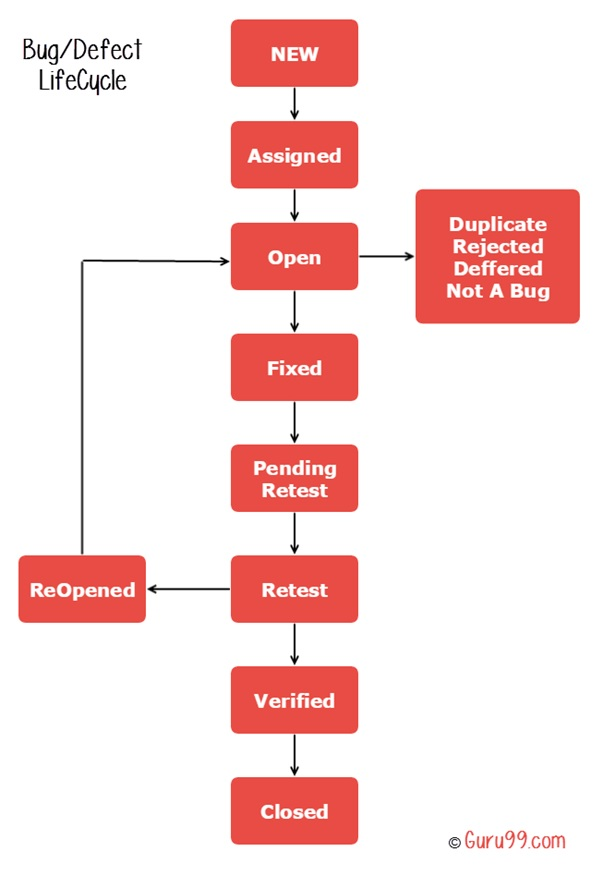

# Manual EXERCISE  
  
## Thank you for taking the time to do an interview with us, in the following document you have different requirements to solve some questions we would like to evaluate. Please, send us back the solution once you have finished.
  
  
### We are working in a new app called HolidaysToMiami, and the first scenario we must cover is **Registration **Requirements**.

### 1. From the companFirst time users open the app, they need to register into the app by filling in these fields and requirements:  

- FIRST NAME* (10 chars max)
- LAST NAME* (60 chars max)
- ADDRESS 1 (120 numbers and chars)
- ADDRESS 2 (120 numbers and chars)
- DATE OF BIRTH* (YYYY-MM-DD, only numbers)
- USER NAME* (10 chars max. no especial chars)
- PASSWORD* (8 to 14 chars max. Must include uppercase and lowercase
letters, a especial char and numbers)
- REPEAT PASSWORD*

**Note**: identifies all mandatory fields.

### 2. If a mandatory field is sent empty in the registration process, it should display an error message: “Registration process went wrong, we need all mandatory information”.
  
  
### 3. If a field is not properly written as requirement, it should display an error message: “Registration process went wrong, please, review all information sent”.  
  
### 4. Once the user has completed their registration, they can login into the app using their USER NAME and Password
- If USER NAME, password or both are incorrect, it should display an error message: “We can’t recognize you, sorry, try it again.”
  
  
## **Questions:**  
  
### 1. Considering all previous requirements, do the Test Plan (cover as many scenarios as you can, including main validations)  
Here's a link to a Test Plan for this scenario: [Test Plan](./test_plan_deliverable.md)
  
  
### 2. Once Test Plan is done and testing has started, you find an error. What should you do?  
I will assume the Jira Xray way of doing things for the sake of talking about something I know.  
In each case, Test Execution should be reported to the Test Plan, the Test Plan will display the Test Case which is failing. In this case, I as QA, will make a ticket report as BUG, to the Dev team in the Sprint into which this project has been assigned to. I will mark the specific Dev who was in charge of this specific functionality or Test. To make things more dynamic, I will write him  DM in Microsoft Teams, telling him that we found a BUG and linking him to BUG ticket that would detail all information, like I will explain in the next question.
### 3. In the process of USER NAME validation, you discover it accepts more than 10 chars. What kind of information would you include in the defect report?  
I would format the Defect ticket like this:
**url**: https://www.holidaysyomiami.com/register
**environment**: Production
**issue**: the USER NAME field accepts more than 10 characters
**steps to reproduce**: it will detail the steps required in order to reproduce the defect
**screenshots**: (some screenshots of the page, the page with the input filled in with more than 10 characters, screenshot of the page successfully submitting the information)
**priority**: high
**sprint**: in the specific current sprint of this project
**asignees**: Dev team lead, API/Back End lead (they'll assign it to the proper devs in their team). Or if there's a specific known dev that handled the project (or two if we're talking about F.E. and API solutions at the same time) then set them both as assignees

**acceptance criteria**: the USER NAME input should no longer be able to accept in more than 10 characters, front end and API solutions must be provided in order to avoid User Name to exceed 10 characters..
  
  
### 4. What’s the defect life cycle? Differences between bug and defect?
**Defect life cycle**:  
In this case an image will explain in very well what's the life cycle of a defect.
  
It can be **New** if it is just spotted and reported. **Assigned**, when it is assigned to a Dev to work on it to solve it. **Open** if the Dev is working on it already. **Duplicate** if it is found as already reported before. **Fixed** when the Dev delivers the solution. **Pending retests** when it is accepted for testing stage. **Retest** when it is tested. After the testing it will be either **Reopened** and reassigned to a Dev, or **Verified** by another dev and/or QA. And finally when it is solved, it will be **Closed**.  
  
**Difference between bug and defect**:  
A bug is found in the **Development process**, which means, before it was finished and delivered, up and running. A defect is found after this.  
  

### 5. Imagine that now you want to automate some test cases of your Test Plan. Could you describe the steps you have to do to have your repository ready and what’s the workflow you’d follow to open a pull request with the new test cases in GitHub?
**Automating the Test Cases specified in the Test Plan**:
Ideally the test cases described in the test plan, would be able to be exported directly into the Automated Testing Software Solutions IDE. This would be done the following way. The test plan, found in the Jira Xray ticket, would have an export function. Assuming it is an End to End Test, it would do the following for each test case. Write the description for each superset, the expected result of the test. All formatted accordingly with the E2E testing software of choice. All the QA or Dev would have to do is to write the steps of the test in the program. Execute and import the test results (let's assume Junit XML report output export format) into Jira's Xray. Where they'd be displayed in the Test Plan ticket.
  
**New Test Cases in a Pull Request, in Github**:  
First, have your branch ready. Take the Dev branch, and make a branch off it. The IDE will take off it, all you have to do is go to the Dev branch and create a new branch based from the Dev branch.  
Assuming you have your test suit installed and integrated in the project, all you have to do is write the tests and execute them. After all tests have been processed accordingly. 
The best practices would suggest that you perform a git rebase from the Dev branch in order to keep your branch up to date and easier to process for the merge that the project manager would have to do to integrate the pull request if there are any conflicts. After that you push the changes, and create a pull request. With the Visual Studio Community IDE, that's as simple as this:
Git > Github > Create New Pull Request. 
The Github repo will be opened in a browser and there you can comment on the PR and send it.